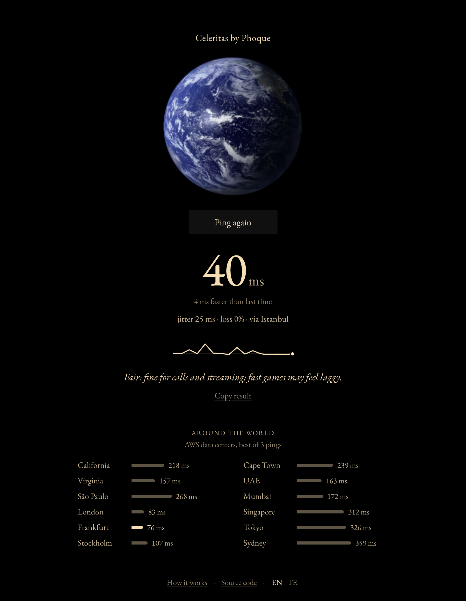
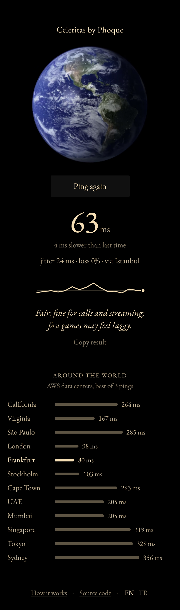

# Celeritas

A sleek and minimalist ping test that runs in your browser. It measures ping, jitter and packet loss to the nearest server, tells you what that means for gaming, calls and streaming, then shows how far away the rest of the world is.

**[Try it live →](https://phoque52.github.io/celeritas/)**

[](https://github.com/Phoque52/celeritas/actions/workflows/tests.yml)

<p align="center">
  
  &nbsp;
  
</p>

## Features

- **Honest numbers.** Warm-up requests open the connection first, so DNS, TCP and TLS setup never count as ping. Every round trip is read from the browser's Resource Timing API instead of JavaScript timers.
- **Ping, jitter and packet loss**, plus a plain-language verdict for gaming, video calls and streaming.
- **Live results.** The number settles as replies arrive, a chart plots every round trip, and a sonar ring leaves the globe with each reply.
- **Around the world.** Latency to 12 AWS regions from California to Sydney, measured six at a time.
- **Comparison with your last test**, kept only in your browser.
- **English and Turkish**, picked from your browser's language.
- **Accessible.** Space starts a test and Escape stops it, results are announced to screen readers, the chart has a text version, and reduced-motion settings get a still globe.
- **Small.** No frameworks, no build step, no dependencies. The page loads less than 1 MB; the globe alone used to be 25 MB.

## How it works

Browsers can't send ICMP packets, so Celeritas times HTTPS round trips instead.

1. **Find the nearest server.** `https://1.1.1.1/cdn-cgi/trace` is answered by the closest of Cloudflare's 330+ data centers, and the reply names it (`colo=IST`). If that address is blocked, Celeritas falls back to `www.cloudflare.com`, then to Google's `generate_204`.
2. **Warm up.** Two requests open the connection and are thrown away. Opening a connection costs several round trips (DNS, TCP, TLS), which is why a single-request test reads far too high.
3. **Sample.** 16 requests go out one after another over the open connection. Each round trip comes from the [Resource Timing API](https://developer.mozilla.org/en-US/docs/Web/API/Performance_API/Resource_timing): the browser's network stack timestamps the request, so work on the page (rendering, garbage collection) can't inflate it.
4. **Summarize.** Ping is the median round trip. Jitter is the average difference between consecutive round trips. Loss is the share of requests with no reply within 2 seconds.
5. **Survey the world.** AWS DynamoDB answers `/ping` in every region without a key. Each region gets one warm-up and three timed requests, and the list shows the fastest: distance sets a floor under latency and congestion only adds to it.

An HTTPS round trip includes a little work on the server and in the browser, so it reads slightly above `ping` in a terminal. In testing it ran about 10 ms higher than ICMP ping to the same Cloudflare server.

### Verdicts

| Grade | When |
| --- | --- |
| Excellent | ping ≤ 30 ms, jitter ≤ 5 ms, nothing lost |
| Good | good enough for gaming: ping ≤ 60 ms, jitter ≤ 15 ms, nothing lost |
| Fair | good enough for calls: ping ≤ 150 ms, jitter ≤ 30 ms, at most 1 of 16 requests lost |
| Unstable | the delay is fine for calls, but jitter or loss isn't |
| Slow | good enough for streaming: ping ≤ 300 ms, at most 2 of 16 requests lost |
| Poor | anything worse |

## Project structure

```
index.html              the page
css/style.css           all styles
js/main.js              entry point
js/ui/app.js            state and rendering, the only code that touches the page
js/ui/sparkline.js      the round-trip chart
js/ui/world-view.js     the world list
js/engine/probe.js      one timed request: Resource Timing, timeout, cancellation
js/engine/measure.js    warm-up, sampling and fallback between targets
js/engine/stats.js      median, jitter and loss
js/engine/verdict.js    the gaming, calls and streaming rating
js/engine/world.js      measures many regions in parallel
js/data/targets.js      the servers and regions
js/data/colos.js        Cloudflare data center names (generated)
js/i18n.js              English and Turkish text
js/history.js           past results in localStorage
scripts/                local server and the colos.js generator
tests/                  node:test suites
```

The engine doesn't touch the DOM, so the tests run it in Node against a fake network, clock and Resource Timing buffer. They cover timeouts, cancellation, fallback, loss and the statistics.

## Running it locally

You need Node.js 22 or later for the local server and the tests. The app itself has no dependencies.

```bash
npm start
```

Then open http://localhost:8000. Opening `index.html` directly won't work, because browsers don't load ES modules from `file://` URLs.

```bash
npm test
```

```bash
npm run update-colos
```

The last command refreshes the data center names from Cloudflare's status page.

## Privacy

Celeritas has no server of its own and no analytics. The test only contacts Cloudflare, AWS and, as a fallback, Google, sending no cookies and no referrer. Your past results stay in your browser's local storage, and the page's font comes from Google Fonts.

## License

[MIT](LICENSE)
